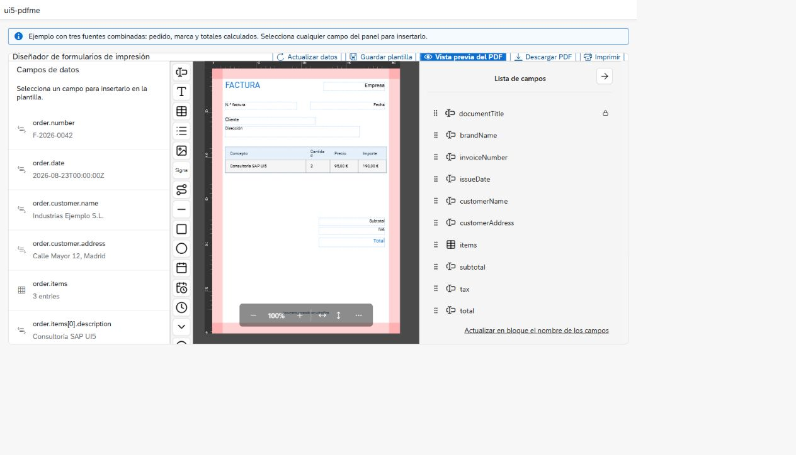

<div align="center">

# ui5-pdfme

Estudio visual de plantillas PDF para SAPUI5, OpenUI5, Fiori, React y JavaScript independiente de frameworks.

[🇬🇧 English](README.md) · [🇪🇸 Español](README.es.md)

[](https://github.com/jesusfrguz/ui5-pdfme/actions/workflows/ci.yml)
[](https://github.com/jesusfrguz/ui5-pdfme/releases)
[](LICENSE)
[](https://nodejs.org/)

[](https://developer.mozilla.org/es/docs/Web/JavaScript)
[](https://react.dev/)
[](https://ui5.sap.com/)
[](https://pdfme.com/)

</div>

Combina el diseñador y generador de [pdfme](https://pdfme.com/) con fuentes de datos declarativas JSON, REST, OData V2/V4 y calculadas.



## Características

- Editor visual para texto, tablas, listas, imágenes, firmas, SVG, formas, fechas y códigos de barras.
- Un único contrato de plantillas, datos y mapeos para UI5, JavaScript y React.
- Fuentes JSON, REST, OData V2/V4, modelos UI5 y funciones registradas.
- Fuentes dependientes o concurrentes, proveedores personalizados, cargadores y formateadores.
- Vista previa del PDF, generación de bytes, descarga e impresión desde el navegador.
- Plantillas JSON versionables, aptas para OData, CAP, ABAP, BTP o cualquier backend.
- Catálogo de plantillas adaptable con búsqueda, filtros por estado y origen, carga y guardado.
- Repositorios de plantillas conectables para memoria, localStorage, REST, OData y funciones de aplicación.
- [Documentación web](https://jesusfrguz.github.io/ui5-pdfme/) técnica y funcional, y [guía de integración para IA](AGENTS.md).
- [Ejemplos en vivo de OpenUI5, JavaScript y React](https://jesusfrguz.github.io/ui5-pdfme/examples/), compilados y desplegados desde `main` con GitHub Pages.

## Instalación

```bash
npm install ui5-pdfme
```

Hasta que el paquete se publique en npm, instala la última versión precompilada desde GitHub Releases, que incluye la distribución UI5:

```bash
npm install $(node -e "fetch('https://api.github.com/repos/jesusfrguz/ui5-pdfme/releases/latest').then(r => r.json()).then(r => console.log(r.assets.find(a => a.name.endsWith('.tgz')).browser_download_url))")
```

Para el desarrollo se requiere Node.js 20 o posterior. Las aplicaciones de navegador deben usar un empaquetador moderno compatible con ESM y WASM, como Vite.

## JavaScript

```html
<div id="studio" style="height:760px"></div>
```

```javascript
import { WebPdfTemplateStudio } from "ui5-pdfme";

const studio = new WebPdfTemplateStudio("#studio", {
  template,
  templateRepositories: [{ id: "browser", type: "localStorage", storageKey: "my-app.templates" }],
  dataSources: [
    { id: "order", type: "rest", url: "/api/orders/5001" },
    { id: "brand", type: "json", data: { company: "Example S.L." } }
  ],
  mapping: {
    fields: {
      customer: "order.customerName",
      company: "brand.company",
      items: { path: "order.items", formatter: "table", options: { columns: ["description", "quantity", "amount"] } }
    }
  },
  language: "es",
  filename: "pedido.pdf"
});
```

Ejecuta el ejemplo completo con `npm run example:js`.

## React

```jsx
import { PdfTemplateStudio } from "ui5-pdfme/react";

<PdfTemplateStudio
  ref={studioRef}
  template={template}
  templateRepositories={[{ id: "browser", type: "localStorage", storageKey: "my-app.templates" }]}
  dataSources={dataSources}
  mapping={mapping}
  language="es"
  filename="pedido.pdf"
/>
```

La referencia expone la API del estudio subyacente. Ejecuta `npm run example:react` para ver el ciclo completo de carga y actualización.

## SAPUI5 / OpenUI5 / Fiori

Declara la librería en `manifest.json`:

```json
{
  "sap.ui5": {
    "dependencies": {
      "minUI5Version": "1.71.0",
      "libs": {
        "sap.m": {},
        "ui5.pdfme": {}
      }
    }
  }
}
```

Usa el control nativo:

```xml
<mvc:View xmlns:mvc="sap.ui.core.mvc" xmlns="sap.m" xmlns:pdf="ui5.pdfme">
  <pdf:PdfTemplateStudio id="printStudio" height="48rem" filename="pedido.pdf" />
</mvc:View>
```

```javascript
this.byId("printStudio").configure({
  template: template,
  templateRepositories: [{ id: "templates", type: "odata", modelName: "templates", path: "/Templates" }],
  dataSources: [{
    id: "order",
    type: "odata",
    modelName: "main",
    path: "/SalesOrderList('5001')",
    parameters: { $expand: "Items" }
  }],
  mapping: { fields: { orderNumber: "order.SalesOrder" } }
});
```

El adaptador UI5 utiliza los modelos propagados OData V2/V4 y JSON. El artefacto npm contiene los recursos UI5 precompilados; las aplicaciones consumidoras no necesitan la tarea de compilación personalizada de este repositorio.

El mismo artefacto UI5 es compatible con SAPUI5/OpenUI5 1.71.x y 1.120.x en navegadores modernos. Utiliza las API `sap/ui/core/Core` y `sap/base/i18n/ResourceBundle`, compartidas por ambas ramas; `sap/ui/core/Lib` no se carga ni se incluye en el paquete. Internet Explorer no es compatible.

## API compartida

```javascript
await studio.refreshData();
const bytes = await studio.generate();
await studio.preview();
await studio.download();
await studio.print();
studio.openHelp();

studio.getTemplate();
studio.getResolvedData();
studio.getInputs();
studio.registerDataProvider(type, provider);
studio.registerLoader(name, loader);
studio.registerFormatter(name, formatter);

await studio.listTemplates({ search: "invoice", status: "published" });
await studio.loadTemplate("invoice-es", { repositoryId: "templates" });
await studio.saveTemplateRecord({ name: "Invoice", tags: ["sales"] });
```

La barra de herramientas incluye un diálogo bilingüe de ayuda rápida. Configura `helpUrl` para dirigirlo a un manual específico de la aplicación, usa `showHelp: false` cuando la aplicación contenedora ya proporcione ayuda y escucha el evento `pdfme:help` o el evento UI5 `help` cuando necesites observar la apertura de la ayuda.

Los campos estáticos y los campos de texto enlazados a datos ofrecen **Posición fija sin desplazamiento** (`fixedPosition: true`). Esta opción mantiene el elemento en sus coordenadas absolutas y fuera del flujo de contenido dinámico. Al activarla aparece la opción **Repetir en cada página** (`repeatOnEveryPage: true`). El esquema guardado sigue siendo seleccionable en el diseñador; la vista previa y la generación materializan el contenido fijo, incluido su valor resuelto, sin modificar la plantilla guardada. Durante la generación, los campos fijos repetidos amplían automáticamente el límite `basePdf.padding` superior o inferior más cercano, para que el contenido dinámico que pasa a otra página no se solape con ellos; el padding configurado sigue siendo el mínimo. El texto estático repetido admite `{currentPage}` y `{totalPages}`.

`templateRepositories` acepta fuentes `memory`, `localStorage`, `rest`, `odata` y `function`. La acción Plantillas de la barra de herramientas abre el catálogo visual, desde el que se puede empezar con una plantilla A4 en blanco, cargar un PDF existente como `basePdf` de pdfme o buscar y filtrar los repositorios configurados. La creación y la importación siguen disponibles sin repositorio; para persistir los cambios sí se necesita uno. En Web, REST/OData sigue los enlaces hasta `maxPages`; OData V4 de UI5 usa `pageSize` y `maxRecords`. Las definiciones de fuentes de datos almacenadas se excluyen de forma predeterminada y requieren activar expresamente `persistDataSources` y `applyStoredDataSources`.

Los eventos web llevan el prefijo `pdfme:`. `WebPdfTemplateStudio` emite `pdfme:templateSave`, `pdfme:templateLoaded`, `pdfme:templateSaved`, `pdfme:dataResolved`, `pdfme:generated` y `pdfme:error`; `WebTemplateCatalog` emite `pdfme:templatesListed` y `pdfme:templateOpen` en su propia raíz. El control UI5 expone los eventos nativos equivalentes del ciclo de vida.

## Documentación

- [Guía de usuario en español](docs/guide/index.html) · [Inglés](docs/guide/en.html)
- [Documentación web técnica y funcional](https://jesusfrguz.github.io/ui5-pdfme/)
- [Instrucciones para agentes de IA](AGENTS.md)
- [Receta para SAPUI5/OpenUI5/Fiori](agents/INSTALL_UI5.md)
- [Receta para JavaScript](agents/INSTALL_JAVASCRIPT.md)
- [Receta para React](agents/INSTALL_REACT.md)
- [Creación de plantillas](agents/CREATE_TEMPLATE.md)
- [Integración de datos y OData](agents/DATA_INTEGRATION.md)
- [Guía de catálogo y repositorios de plantillas](docs/repositories/index.html)
- [Selector de backends SAP: RAP, CAP, CDS y SEGW](docs/sap/index.html)
- [Manual de generación diferida para CAP, Docker, Node, Fiori, BTP y ABAP](docs/deferred/index.html)
- [Código ejecutable de generación diferida](examples/deferred/README.md)
- [Receta de integración de repositorios para agentes](agents/TEMPLATE_REPOSITORIES.md)
- [Lista de validación](agents/VALIDATION_CHECKLIST.md)

## Desarrollo

```bash
npm ci
npm test
npm run build
npm run build:legacy
npm run start
npm run start:legacy
npm run docs:dev
```

`dist-v6/` se genera una sola vez con OpenUI5 1.120.x y no debe editarse manualmente. `build:legacy` valida ese mismo artefacto precompilado con OpenUI5 1.71.x; no crea una segunda distribución publicable. La compilación de desarrollo corrige una incompatibilidad concreta de la versión fijada de `ui5-tooling-modules` con los recursos PDFium/WASM de pdfme; el parche es idempotente y falla ante versiones de las herramientas que no admite.

Tanto `npm run start` como `npm run start:legacy` abren la demostración con un catálogo de ejemplo que ya contiene una factura, una etiqueta de envío y un pedido de compra. El catálogo permite buscar y filtrar; al seleccionar una entrada, esta se carga en el diseñador, donde puede editarse y guardarse en el repositorio del navegador. `start:legacy` recompila primero `dist-v6/` para que el servidor OpenUI5 1.71.x utilice siempre las fuentes actuales de la librería.

## Seguridad y producción

- Mantén las credenciales y los tokens de acceso fuera de las plantillas y de las definiciones de fuentes de datos.
- Limita los orígenes remotos permitidos e impón límites de colección y tiempos de espera.
- Autoriza y versiona la publicación de plantillas en el backend.
- Prueba textos largos, tablas vacías y extensas, saltos de página, fuentes tipográficas, configuración regional y zona horaria.
- Los navegadores normales siempre muestran el diálogo de impresión; la impresión silenciosa requiere infraestructura externa controlada.

## Autor

[Jesús Franco Guzmán](https://www.linkedin.com/in/jesus-franco-guzman/)

## Licencia y atribuciones

Copyright © 2026 [Jesús Franco Guzmán](https://www.linkedin.com/in/jesus-franco-guzman/). Este proyecto se distribuye bajo la licencia Apache-2.0. Utiliza y distribuye componentes de pdfme, publicados bajo la licencia MIT y con copyright © 2020 HandDot. Consulta [LICENSE](LICENSE), [NOTICE](NOTICE) y [THIRD_PARTY_NOTICES.md](THIRD_PARTY_NOTICES.md).
